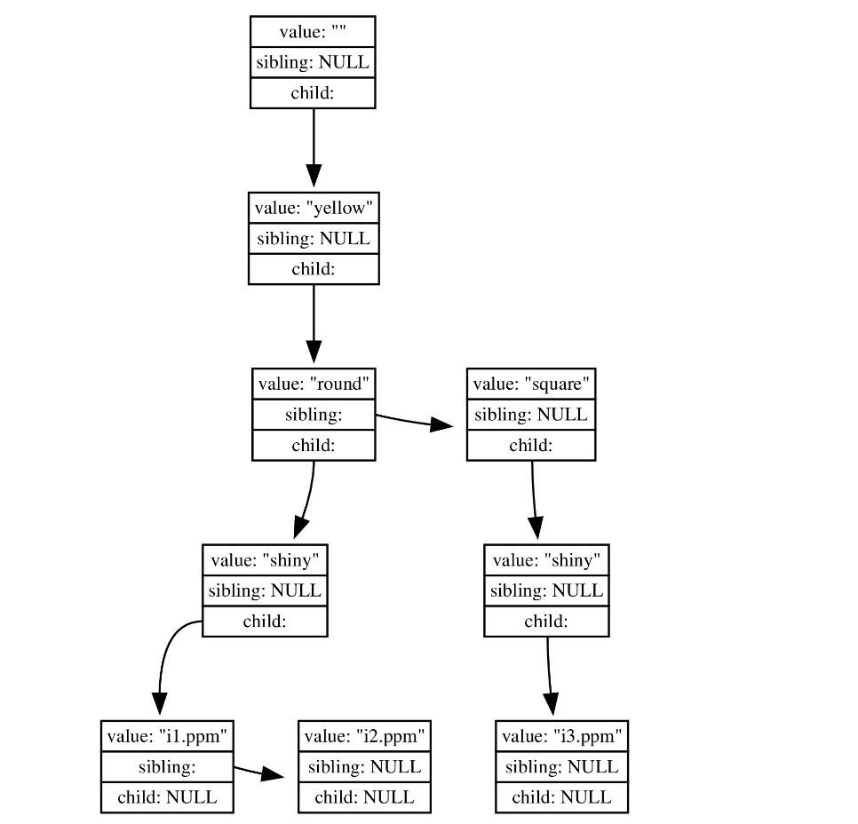

# Description #
It is important to ease data access so that logs and reports can be completed more effectively. This project consists of an image database that allows for storage and querying of different image files. When entering an image a user must select some attributes associated with the image. These attributes are then used to query. When querying a user must select an array of attributes and the query will return all images with all the given attributes. The user can also perform removal queries where images with the given attributes are deleted. The project also allows for a print command which prints all of the current images in the database. Keep in mind that when querying, images are returned in order of insertion, that is the most recently added images in that query will appear last.
# Storage Workflow #

